<h1 align="center">
  DESIGN PATTERNS IN 
</h1>

### Overview 🤔

This project is a design patterns compilation with examples in Typescript.

## Getting Started 🚀

To execute patterns must be:

* Install dependencies:
```sh
pnpm i
```

* Run command:
```sh
pnpm run dev
```

> [!TIP]
> You can edit file `./src/index.ts` to change patterns to execute using `DesignPatternsManager` class
>
> ```ts
>   // Run all patterns
>   await manager.runAll()
>
>   // Run specific pattern
>   await manager.run(manager.getPatterns().SINGLETON)
> ```
>

## Definitions 📚

A design pattern is a general, reusable solution to a common problem in software design. It is a description of a set of interacting objects and their relationships, as well as the rules and guidelines for their use.

Characteristics

* Reusability
* Abstraction
* Modularity
* Flexibility

Classification

* Creational
* Structural
* Behavioral

### Creational Patterns 🏭

* Singleton

Restricts a class from instantiating multiple objects. It creates a single instance of a class and provides a global point of access to that instance.

<p align="center">
  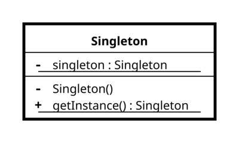
</p>

* Factory

Provides a way to create objects without specifying the exact class of object that will be created. It defines an interface for creating objects, and lets subclasses decide which class to instantiate.

<p align="center">
  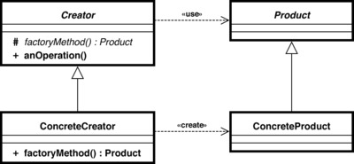
</p>

* Abstract Factory

Provides a way to create families of related objects without specifying their concrete classes. It defines an interface for creating objects, and lets subclasses decide which classes to instantiate and how to create them.

<p align="center">
  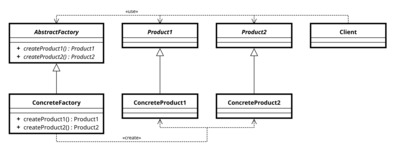
</p>

* Builder

Separates the construction of complex objects from their representation. It allows you to construct objects step-by-step, and provides a way to create different representations of the same object.

<p align="center">
  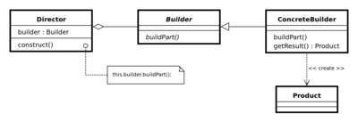
</p>

* Prototype

Allows you to create new objects by copying existing objects, without making your code dependent on their classes. It provides a way to create objects that are initialized with values from another object.

<p align="center">
  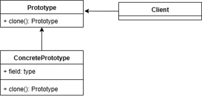
</p>

### Structural Patterns 🧩

* Adapter

Allows two incompatible objects to work together by converting the interface of one object into an interface expected by the other object.

<p align="center">
  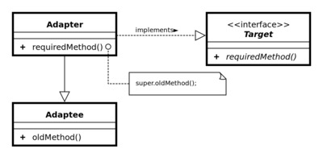
</p>

* Bridge

Separates an object's abstraction from its implementation, allowing them to vary independently, favoring greater flexibility and extensibility.

<p align="center">
  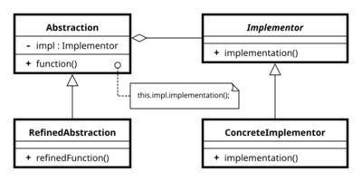
</p>

* Composite

Allows you to compose objects into a tree-like structure, where each node can be either a leaf node or a composite node. This pattern enables you to treat individual objects and compositions of objects uniformly, making it easier to work with complex structures.

<p align="center">
  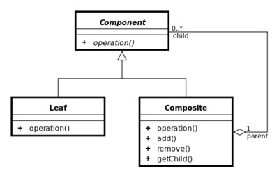
</p>

* Decorator

Allows you to dynamically add or remove additional responsibilities from an object without affecting its external interface. This pattern enables you to extend the behavior of an object without modifying its underlying structure.

<p align="center">
  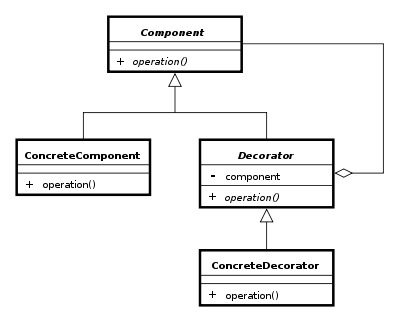
</p>

* Facade

Provides a simplified interface to a complex system of classes, libraries, or frameworks. It hides the complexities of the system and provides a single interface to access the system's functionality.

<p align="center">
  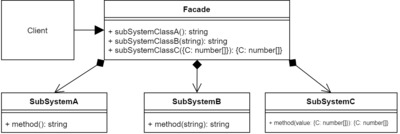
</p>

* Flyweight

Allows multiple objects to share the same state or behavior, reducing the amount of memory used and improving performance.

<p align="center">
  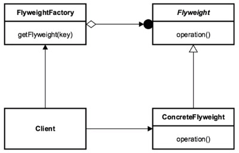
</p>

* Proxy

Acts as an intermediary between the client and the real object, adding additional functionality or controlling access to the original object.

<p align="center">
  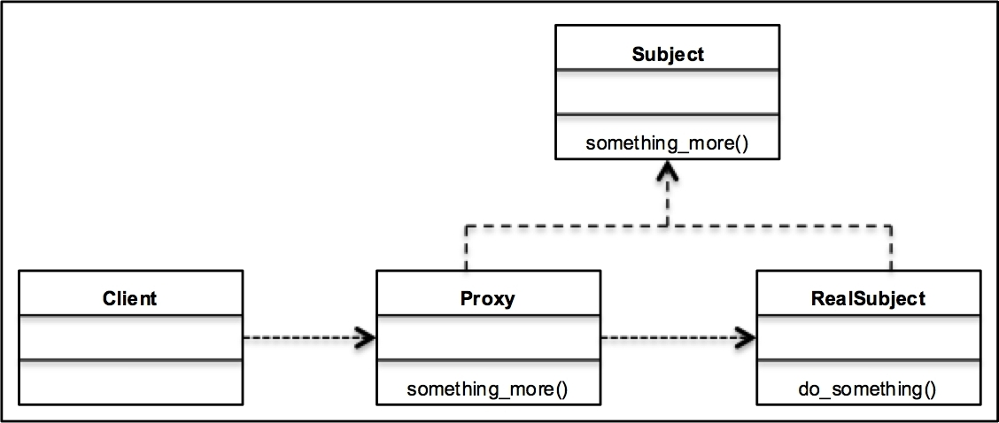
</p>

### Behavioral Patterns 🔁

* Chain of responsibility

Allows multiple objects to handle a request in a sequential manner. Each object in the chain has the opportunity to process the request or pass it to the next object in the chain.

<p align="center">
  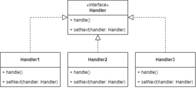
</p>
