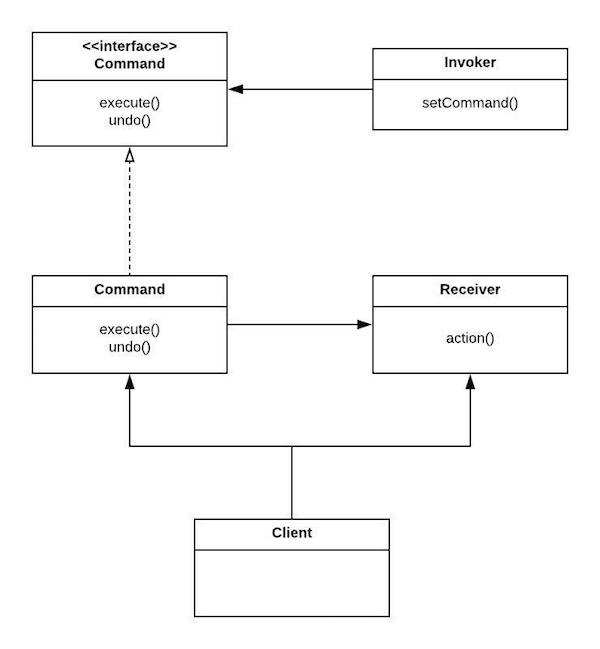
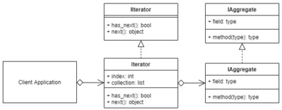
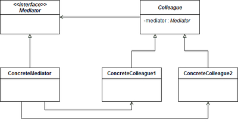
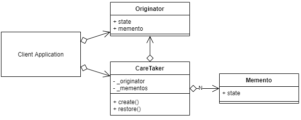
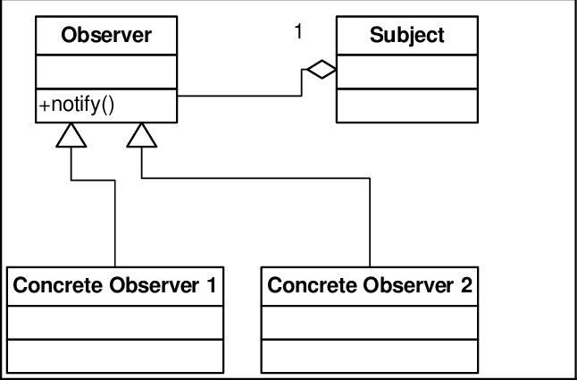
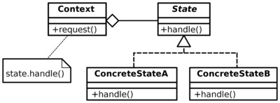
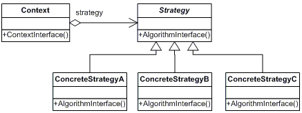
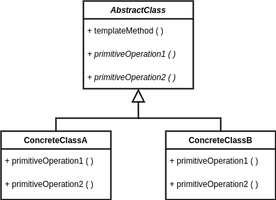
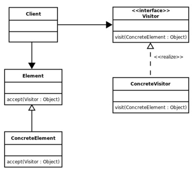

<h1 align="center">
  DESIGN PATTERNS IN 
</h1>

### Overview 🤔

This project is a design patterns compilation with examples in Typescript.

## Getting Started 🚀

To execute patterns must be:

* Install dependencies:
```sh
pnpm i
```

* Run command:
```sh
pnpm run dev
```

> [!TIP]
> You can edit file `./src/index.ts` to change patterns to execute using `DesignPatternsManager` class
>
> ```ts
>   // Run all patterns
>   await manager.runAll()
>
>   // Run specific pattern
>   await manager.run(manager.getPatterns().SINGLETON)
> ```
>

## Definitions 📚

A design pattern is a general, reusable solution to a common problem in software design. It is a description of a set of interacting objects and their relationships, as well as the rules and guidelines for their use.

Characteristics

* Reusability
* Abstraction
* Modularity
* Flexibility

Classification

* Creational
* Structural
* Behavioral

### Creational Patterns 🏭

* [Singleton](./src/patterns/creational/singleton.ts)

Restricts a class from instantiating multiple objects. It creates a single instance of a class and provides a global point of access to that instance.

<p align="center">
  
</p>

* [Factory](./src/patterns/creational/factory.ts)

Provides a way to create objects without specifying the exact class of object that will be created. It defines an interface for creating objects, and lets subclasses decide which class to instantiate.

<p align="center">
  
</p>

* [Abstract Factory](./src/patterns/creational/abstract-factory.ts)

Provides a way to create families of related objects without specifying their concrete classes. It defines an interface for creating objects, and lets subclasses decide which classes to instantiate and how to create them.

<p align="center">
  
</p>

* [Builder](./src/patterns/creational/builder.ts)

Separates the construction of complex objects from their representation. It allows you to construct objects step-by-step, and provides a way to create different representations of the same object.

<p align="center">
  
</p>

* [Prototype](./src/patterns/creational/prototype.ts)

Allows you to create new objects by copying existing objects, without making your code dependent on their classes. It provides a way to create objects that are initialized with values from another object.

<p align="center">
  
</p>

### Structural Patterns 🧩

* [Adapter](./src/patterns/structural/adapter.ts)

Allows two incompatible objects to work together by converting the interface of one object into an interface expected by the other object.

<p align="center">
  
</p>

* [Bridge](./src/patterns/structural/bridge.ts)

Separates an object's abstraction from its implementation, allowing them to vary independently, favoring greater flexibility and extensibility.

<p align="center">
  
</p>

* [Composite](./src/patterns/structural/composite.ts)

Allows you to compose objects into a tree-like structure, where each node can be either a leaf node or a composite node. This pattern enables you to treat individual objects and compositions of objects uniformly, making it easier to work with complex structures.

<p align="center">
  
</p>

* [Decorator](./src/patterns/structural/decorator.ts)

Allows you to dynamically add or remove additional responsibilities from an object without affecting its external interface. This pattern enables you to extend the behavior of an object without modifying its underlying structure.

<p align="center">
  
</p>

* [Facade](./src/patterns/structural/facade.ts)

Provides a simplified interface to a complex system of classes, libraries, or frameworks. It hides the complexities of the system and provides a single interface to access the system's functionality.

<p align="center">
  
</p>

* [Flyweight](./src/patterns/structural/flyweight.ts)

Allows multiple objects to share the same state or behavior, reducing the amount of memory used and improving performance.

<p align="center">
  
</p>

* [Proxy](./src/patterns/structural/proxy.ts)

Acts as an intermediary between the client and the real object, adding additional functionality or controlling access to the original object.

<p align="center">
  
</p>

### Behavioral Patterns 🔁

* [Chain of responsibility](./src/patterns/behavioral/chainOfResponsibility.ts)

Allows multiple objects to handle a request in a sequential manner. Each object in the chain has the opportunity to process the request or pass it to the next object in the chain.

<p align="center">
  
</p>

* [Command](./src/patterns/behavioral/command.ts)

Encapsulates a request as an object, allowing the request to be parameterized, queued, logged and reverted. The key idea behind this pattern is to provide the means to decouple client from receiver.

<p align="center">
  
</p>

* [Iterator](./src/patterns/behavioral/iterator.ts)

Allows you to traverse a collection of objects without exposing the underlying implementation of the collection. It provides a way to access the elements of a collection in a sequential manner, without having to know the details of the collection's internal structure.

<p align="center">
  
</p>

* [Mediator](./src/patterns/behavioral/mediator.ts)

Defines an object that encapsulates how a set of objects interact with each other. It acts as an intermediary between the objects, allowing them to communicate with each other without having a direct reference to one another.

<p align="center">
  
</p>

* [Memento](./src/patterns/behavioral/memento.ts)

Allows an object to capture its internal state and externalize it so that the object can be restored to its previous state later.

<p align="center">
  
</p>

* [Observer](./src/patterns/behavioral/observer.ts)

Provides a way for objects to be notified of changes to other objects without having a tight coupling between them.

<p align="center">
  
</p>

* [State](./src/patterns/behavioral/state.ts)

Allows an object to change its behavior when its internal state changes. It provides a way for objects to be notified of changes to other objects without having a tight coupling between them.

<p align="center">
  
</p>

* [Strategy](./src/patterns/behavioral/strategy.ts)

Allows you to define a family of algorithms, encapsulate each one as a separate class, and make them interchangeable at runtime.

<p align="center">
  
</p>

* [Template](./src/patterns/behavioral/template.ts)

Defines a skeleton of an algorithm in a method, deferring some steps to subclasses. It lets subclasses redefine certain steps of an algorithm without changing the algorithm's structure.

<p align="center">
  
</p>

* [Visitor](./src/patterns/behavioral/visitor.ts)

Allows you to add new operations to a class hierarchy without modifying the existing classes.

<p align="center">
  
</p>
